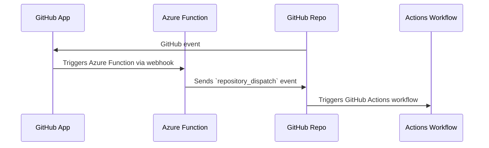

# GitHub Azure Function to mirror GitHub repository events

> ℹ️ This is an _unofficial_ tool created by Field Security Services, and is not officially supported by GitHub.

This Azure Function mirrors GitHub events back to a GitHub repo as a `repository_dispatch` event.

This is necessary since not all [GitHub events](https://docs.github.com/en/enterprise-cloud@latest/webhooks/webhook-events-and-payloads) can [trigger an Actions workflow](https://docs.github.com/en/enterprise-cloud@latest/actions/using-workflows/events-that-trigger-workflows). For example, the `pull_request_review` event cannot trigger a workflow.

> ⚠️ Some repository events can contain sensitive information. See more in "Security Considerations" below.

It needs you to deploy the function on Azure, and to create a GitHub App and install it on an org or repo.

> ℹ️ This is an _unofficial_ tool created by Field Security Services, and is not officially supported by GitHub.

## How it works

The Azure Function is triggered by a GitHub webhook event, via the GitHub App. The Function sends a `repository_dispatch` event to the GitHub repo, with the same payload as the original event.



## Requirements

- an Azure account on an Azure subscription
- a GitHub account

## Filter events

Before you deploy, you can choose to set a declarative filter to apply to GitHub events you receive in the Azure Functions App. This is in addition to selecting the events you choose to listen for in the GitHub App.

This is done in the `fiter.yml` file, with the format shown in `filter.yml.example` and below:

```yaml
# Path: filter.yml

# filter webhook events by type and payload, declaratively

include:
  secret_scanning_alert:
    action: [created, dismissed, resolved, reopened]

exclude:
  secret_scanning_alert:
    action: reopened
  secret_scanning_alert_location:

```

The corresponding exclude filter for an event name is applied after the include filter.

This example will include any event named `secret_scanning_alert` with an action of `created`, `dismissed`, or `resolved`, `reopened` and will exclude any event named `secret_scanning_alert` with an action of `reopened`. It will also exclude any event named `secret_scanning_alert_location`.

The presence of an include filter here means that excluding `secret_scanning_alert_location` is redundant, as it will never be included in the first place, but it is included to show the syntax.

If you do not want to use a filter, you can delete the `filter.yml` file, or leave it empty.

You do not need to provide both an `include` and `exclude` key.


## Installing

See [INSTALL.md](INSTALL.md) for details.

## Create a GitHub Actions workflow

Once the mirror is set up and working, you need to create a GitHub Actions workflow that will run in response to a `repository_dispatch` event.

It should trigger like so:

```yaml
on:
  repository_dispatch:
    types: [...]
```

where `types` is a list of the types of GitHub events you want to trigger the workflow.

The content of the event will be available in the `github.event` context variable, and the payload will be available at `github.event.client_payload`.

## License

This project is licensed under the terms of the MIT open source license. Please refer to the [LICENSE](LICENSE) for the full terms.

## Maintainers

See [CODEOWNERS](CODEOWNERS) for the list of maintainers.

## Support

> ℹ️ This is an _unofficial_ tool created by Field Security Services, and is not officially supported by GitHub.

See the [SUPPORT](SUPPORT.md) file.

## Security Considerations

Some GitHub repository events contain sensitive data that is usually only available to users with privileged access on a repository.

If you use this event mirror, then _anyone with repository write access_ can create a workflow that will be triggered by the events you mirror, which means they will also get full access to the content of that event.

To repeat: some events can contain sensitive information. Consider carefully whether to allow access to _anyone with write access_ the ability to read an event before you mirror it back to the repository.

## Background

See the [CHANGELOG](CHANGELOG.md), [CONTRIBUTING](CONTRIBUTING.md), [SECURITY](SECURITY.md), [SUPPORT](SUPPORT.md), [CODE OF CONDUCT](CODE_OF_CONDUCT.md) and [PRIVACY](PRIVACY.md) files for more information.
