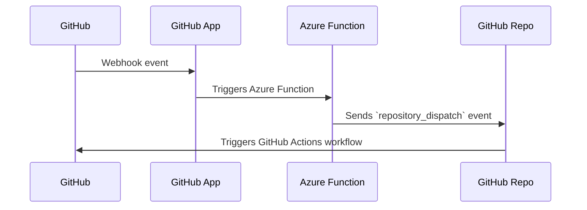

# GitHub Azure Function to mirror webhook events

This Azure Function mirrors GitHub webhook events to a GitHub repo, using a `repository_dispatch` event.

This is necessary since not all [GitHub events](https://docs.github.com/en/enterprise-cloud@latest/webhooks/webhook-events-and-payloads) can [trigger an Actions workflow](https://docs.github.com/en/enterprise-cloud@latest/actions/using-workflows/events-that-trigger-workflows). For example, the `pull_request_review` event cannot trigger a workflow.

It needs you to deploy the function on Azure, and to create a GitHub App and install it on an org or repo.

## How it works

The Azure Function is triggered by a GitHub webhook event, via the GitHub App. The Function sends a `repository_dispatch` event to the GitHub repo, with the same payload as the original event.



## Requirements

- an Azure account on an Azure subscription
- a GitHub account

## Installing

See [INSTALL.md](INSTALL.md) for details.

## Create a GitHub Actions workflow

Once the mirror is set up and working, you need to create a GitHub Actions workflow that will run in response to a `repository_dispatch` event.

It should trigger like so:

```yaml
on:
  repository_dispatch:
    types: [...]
```

where `types` is a list of the types of GitHub events you want to trigger the workflow.

The content of the event will be available in the `github.event` context variable, and the payload will be available at `github.event.client_payload`.
