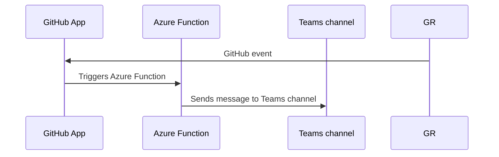

# Teams Secret Scanning notifier (GitHub Azure Function/GitHub App)

> [!WARNING]
> This is an _unofficial_ tool created by Field Security Specialists, and is not officially supported by GitHub.

This project sends notifications to a Teams channel when a secret scanning event happens.

It is implemented as an Azure Function, and installed as a GitHub App.

It needs you to deploy the function on Azure, and to create a GitHub App and install it on an org or repo.

> [!WARNING]
> This is an _unofficial_ tool created by Field Security Specialists, and is not officially supported by GitHub.

## How it works

The Azure Function is triggered by a GitHub webhook event, via the GitHub App.

The Function notifies a Teams channel via a Teams incoming webhook.



## Requirements

- an Azure account on an Azure subscription
- a GitHub account
- a Teams subscription
- an incoming webhook on a Teams channel

## Settings

You will need to set the Teams webhook URL in the Azure Function's application settings. This is covered in the `INSTALL.md` file.

Before you deploy, you can choose to set a declarative filter to apply to GitHub events you receive in the Azure Functions App. This is in addition to selecting the secret scanning events in the GitHub App.

This is done in the `filter.yml` file, with the format shown in `filter.yml.example` and below:

```yaml
# Path: filter.yml

# filter webhook events by type and payload, declaratively

include:
  secret_scanning_alert:
    action: [created, dismissed, resolved, reopened]

exclude:
  secret_scanning_alert:
    action: reopened
  secret_scanning_alert_location:

```

The corresponding exclude filter for an event name is applied after the include filter.

This example will include any event named `secret_scanning_alert` with an action of `created`, `dismissed`, or `resolved`, `reopened` and will exclude any event named `secret_scanning_alert` with an action of `reopened`. It will also exclude any event named `secret_scanning_alert_location`.

The presence of an include filter here means that excluding `secret_scanning_alert_location` is redundant, as it will never be included in the first place, but it is included to show the syntax.

If you do not want to use a filter, you can delete the `filter.yml` file, or leave it empty.

You do not need to provide both an `include` and `exclude` key.

## Installing

See [INSTALL.md](INSTALL.md) for details.

## License

This project is licensed under the terms of the MIT open source license. Please refer to the [LICENSE](LICENSE) for the full terms.

## Maintainers

See [CODEOWNERS](CODEOWNERS) for the list of maintainers.

## Support

> [!WARNING]
> This is an _unofficial_ tool created by Field Security Specialists, and is not officially supported by GitHub.

See the [SUPPORT](SUPPORT.md) file.

## Security Considerations

Secret scanning events contain sensitive data that is usually only available to users with privileged access on a repository.

If you use this notifier, then anyone with access to the Azure Function's subscription may be able to get access to this data.

Anyone with access to the Teams channel may be able to get access to this data.

## Background

See the [CHANGELOG](CHANGELOG.md), [CONTRIBUTING](CONTRIBUTING.md), [SECURITY](SECURITY.md), [SUPPORT](SUPPORT.md), [CODE OF CONDUCT](CODE_OF_CONDUCT.md) and [PRIVACY](PRIVACY.md) files for more information.
